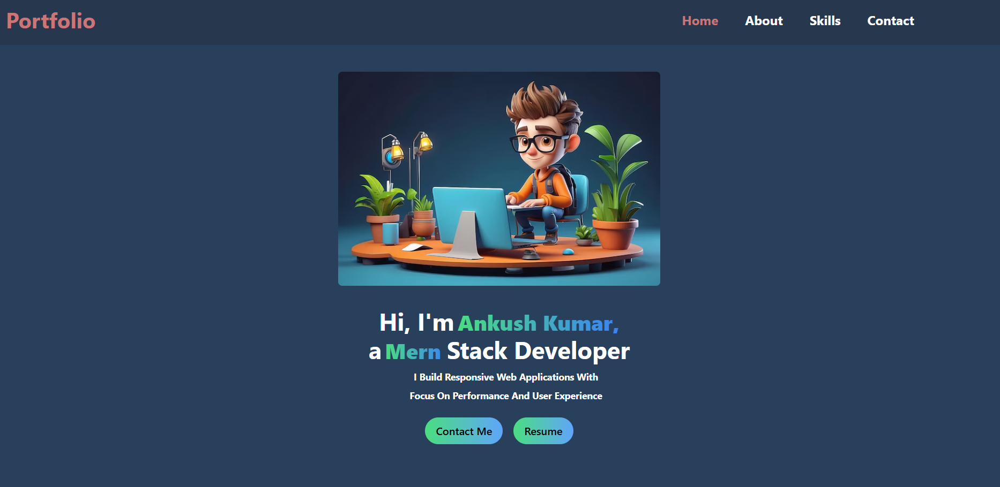
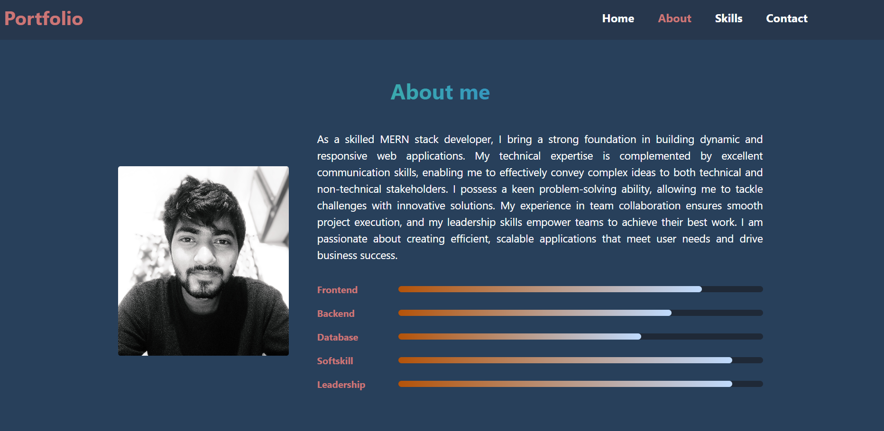
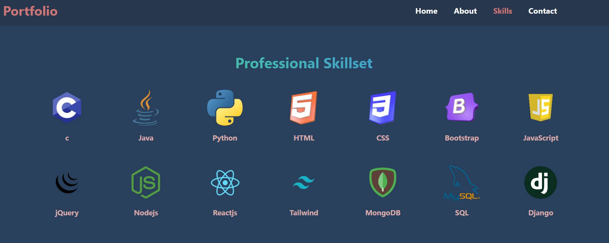
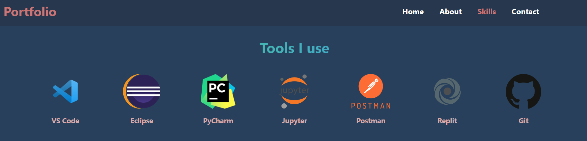
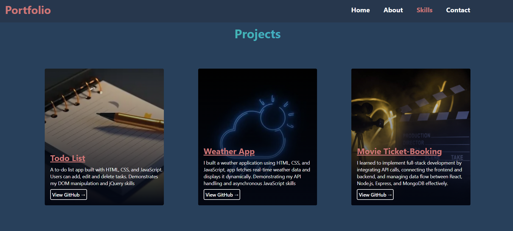
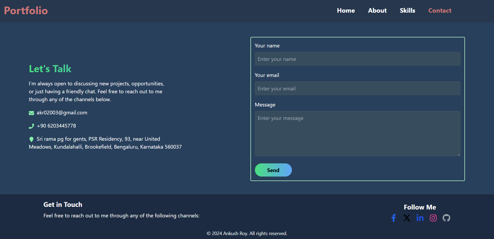
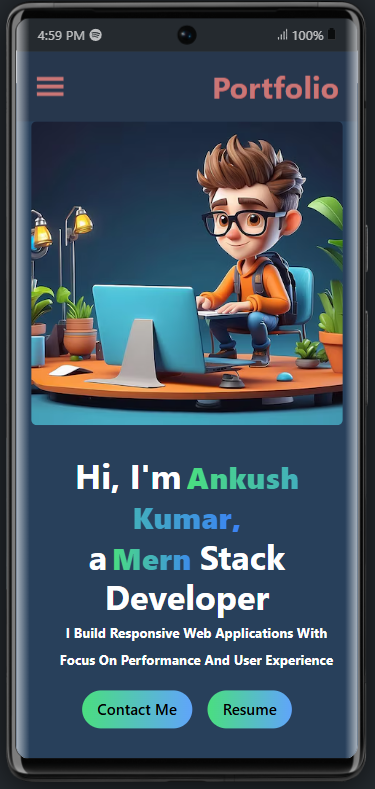
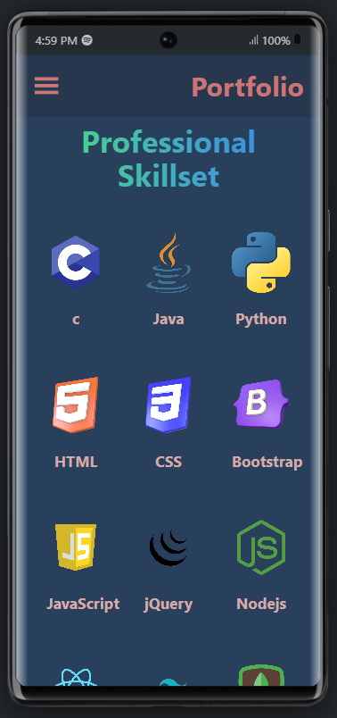
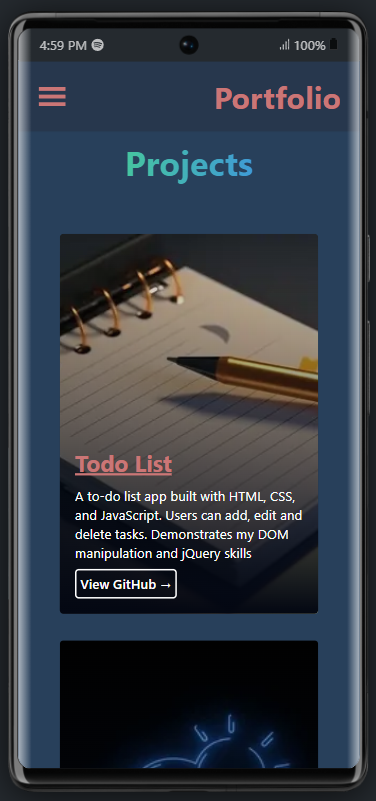
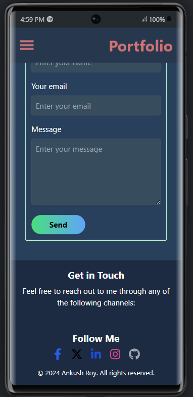

<h1 align="center">Portfolio</h1>

Portfolio web application with HTML, CSS, JavaScript,React, Nodejs and Express

## Table of Contents
* [Project Purpose](#project-purpose)
* [Technologies](#technologies)
* [Quick Tour](#quick-tour)
* [How to run the app](#how-to-run-the-app)


## Project Purpose
* To showcase my projects and skills in web development.
* To provide a user-friendly interface using HTML, CSS, JavaScript, and React for smooth navigation.
* To implement backend functionality using Node.js and Express.
* To offer secure feedback submission through a form using Google OAuth2.0 for authentication and Nodemailer for email communication.
* To allow potential clients or employers to easily contact me.

## Technologies
* HTML5
* CSS3
* ECMAScript 2023
* React
* Tailwind
* Nodejs
* Expressjs
* Nodemailer
* Google OAuth2.0


## Quick Tour
<h2 align="center">Home Page</h2>
<p align="center">
    
</p>

<h2 align="center">About page</h2>
<p align="center">
    
</p>
<h2 align="center">Skills page</h2>
<p align="center">
    
    
    
</p>
<h2 align="center">Contact page</h2>
<p align="center">
    
</p>


<h2 align="center">Responsiveness</h2>
<p align="center">
    
    
    
    
</p>


## How to run the app
1. Download the code
2. Go to 'https://console.cloud.google.com' and create a new project
3. Create .env file in /server
```
CLIENT_ID ='your client id'
CLIENT_SECRET ='your client secret'
REDIRECT_URI ='https://developers.google.com/oauthplayground'
REFRESH_TOKEN = 'your refresh token'

EMAIL='Receivers email id'
PORT=8000
```
4. Start server side
```
cd server
npm install
npm start
```
5. Start client side
```
cd client
npm install
npm run dev
```


